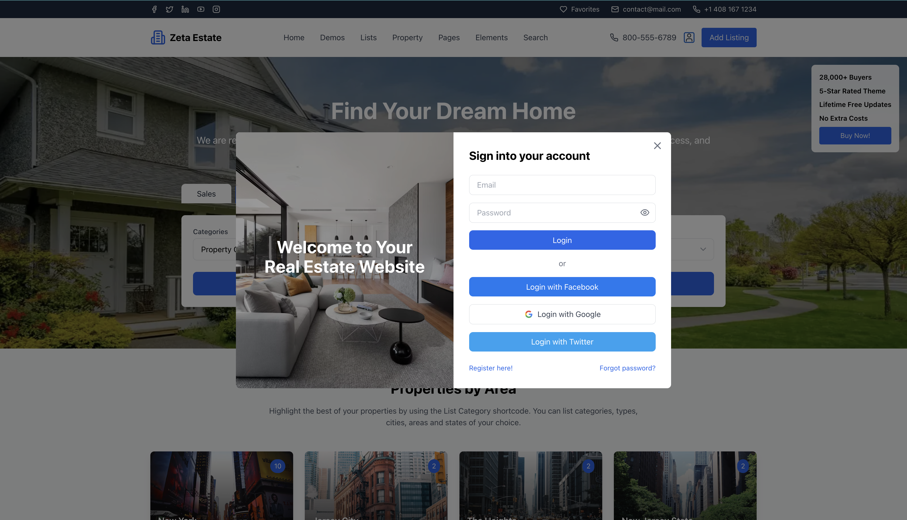
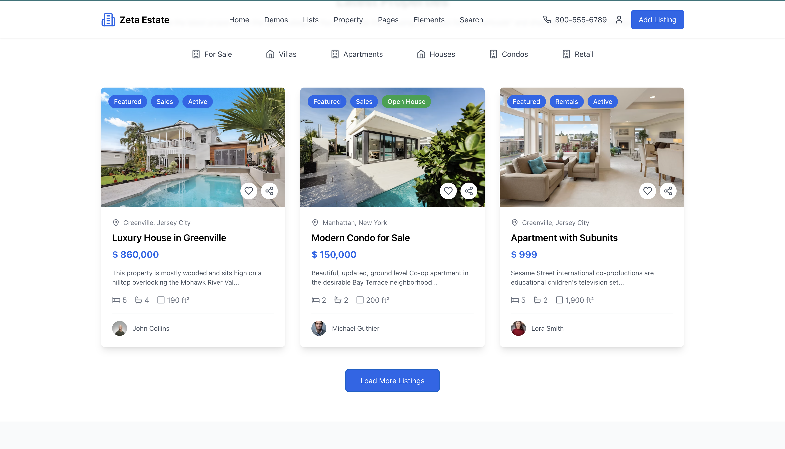
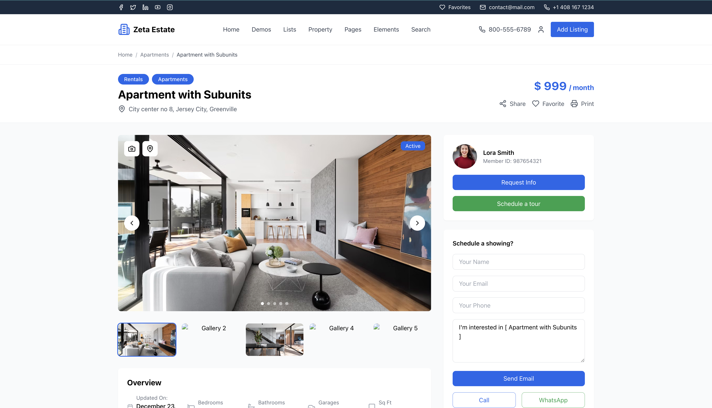
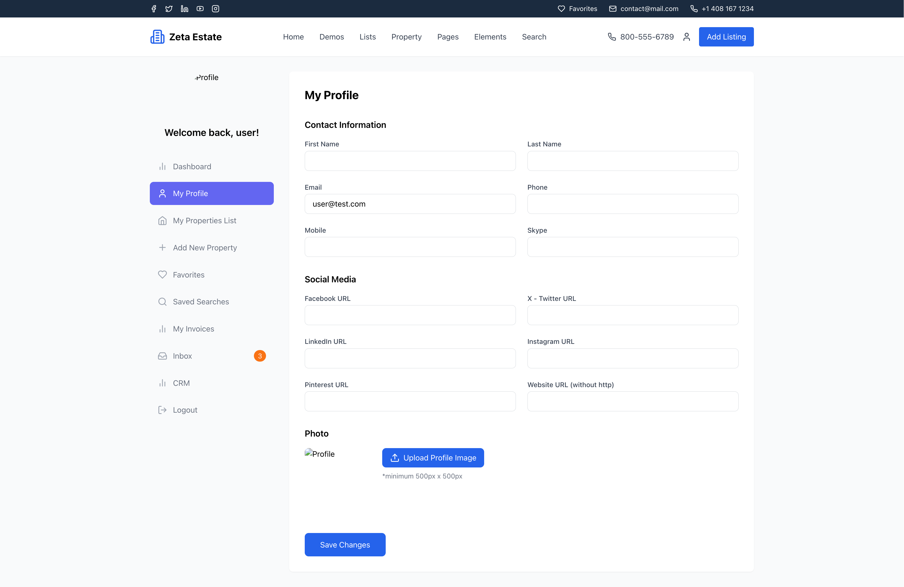
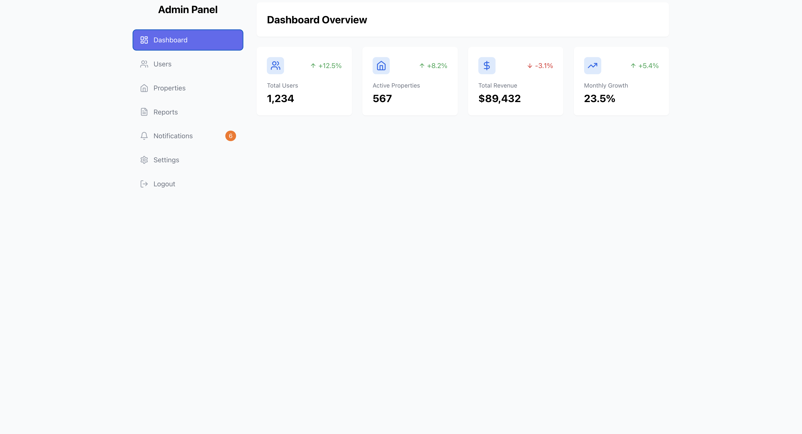

# RealEstate Property Platform React

A modern RealEstate Property Platform built with React, TypeScript, and Tailwind CSS, featuring property listings, user management, and an admin dashboard.

## Screenshots

### Authentication


### HomePage


### Property Listings


### Property Details


### Property Search


### User Dashboard


### Admin Dashboard


## Features

### Public Features
- Property search with map integration
- Property listings with filters
- Property details with image galleries
- Area-based property browsing
- Contact forms for inquiries
- User registration and authentication

### User Dashboard
- Profile management
- Property favorites
- Saved searches
- Inbox messaging
- CRM system
- Invoice management

### Admin Dashboard
- User management
- Property management
- Reports and analytics
- System settings
- Notification management

## Tech Stack

- **Frontend**: React 18 with TypeScript
- **Styling**: Tailwind CSS
- **Icons**: Lucide React
- **Maps**: Google Maps API (@react-google-maps/api)
- **Database**: Supabase
- **Authentication**: Custom auth with Supabase
- **Routing**: React Router v6
- **Build Tool**: Vite

## Project Structure

```
src/
├── components/         # React components
│   ├── admin/         # Admin dashboard components
│   ├── user/          # User dashboard components
│   └── ...            # Shared components
├── lib/               # Utility functions and services
└── assets/           # Static assets

```

## Getting Started

### Prerequisites

- Node.js 18+
- npm or yarn
- Supabase account
- Google Maps API key

### Installation

1. Clone the repository:
```bash
git clone https://github.com/zetaver/Real-Estate-Property.git
cd real-estate-platform
```

2. Install dependencies:
```bash
npm install
```

3. Create a `.env` file in the root directory:
```env
VITE_SUPABASE_URL=your_supabase_url
VITE_SUPABASE_ANON_KEY=your_supabase_anon_key
```

4. Start the development server:
```bash
npm run dev
```

## Available Scripts

- `npm run dev` - Start development server
- `npm run build` - Build for production
- `npm run preview` - Preview production build
- `npm run lint` - Run ESLint

## Component Documentation

### Public Components

#### `HeroSearch`
The main search component on the homepage with property filters.

#### `PropertiesByArea`
Displays properties grouped by geographical areas with interactive cards.

#### `LatestProperties`
Shows the most recent property listings with filtering options.

#### `PropertyDetail`
Detailed view of a single property with images, features, and contact forms.

### User Dashboard Components

#### `UserDashboard`
Main dashboard layout with navigation and user profile management.

#### `MyPropertiesList`
List of properties owned/managed by the user.

#### `Favorites`
Saved property listings.

#### `SavedSearches`
Stored search criteria with notification options.

### Admin Components

#### `AdminDashboard`
Main admin interface with analytics and quick actions.

#### `Users`
User management interface.

#### `Properties`
Property management with CRUD operations.

#### `Reports`
Analytics and reporting tools.

## Authentication

The platform uses a custom authentication system with the following roles:
- Guest (unauthenticated)
- User
- Agent
- Agency
- Developer
- Admin

Test credentials are available for each role:
```javascript
user@test.com / test123
admin@test.com / admin123
```


## Security

- Row Level Security (RLS) enabled on all tables
- User-specific policies for data access
- Protected API routes
- Secure password handling
- CORS configuration

## Contributing

1. Fork the repository
2. Create a feature branch
3. Commit your changes
4. Push to the branch
5. Create a Pull Request

## License

This project is licensed under the MIT License - see the LICENSE file for details.